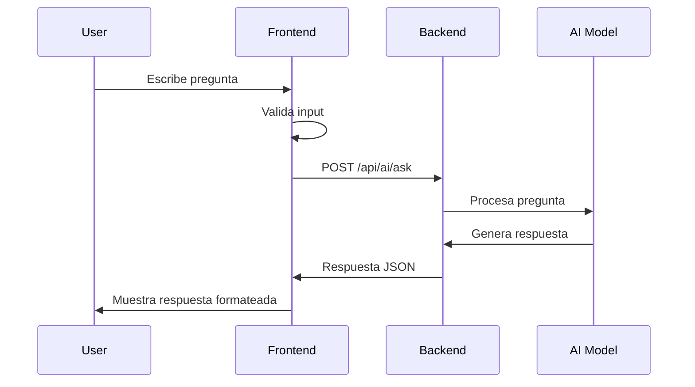
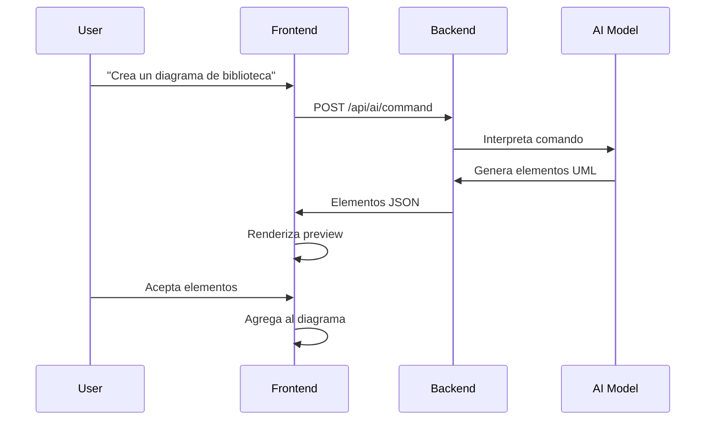
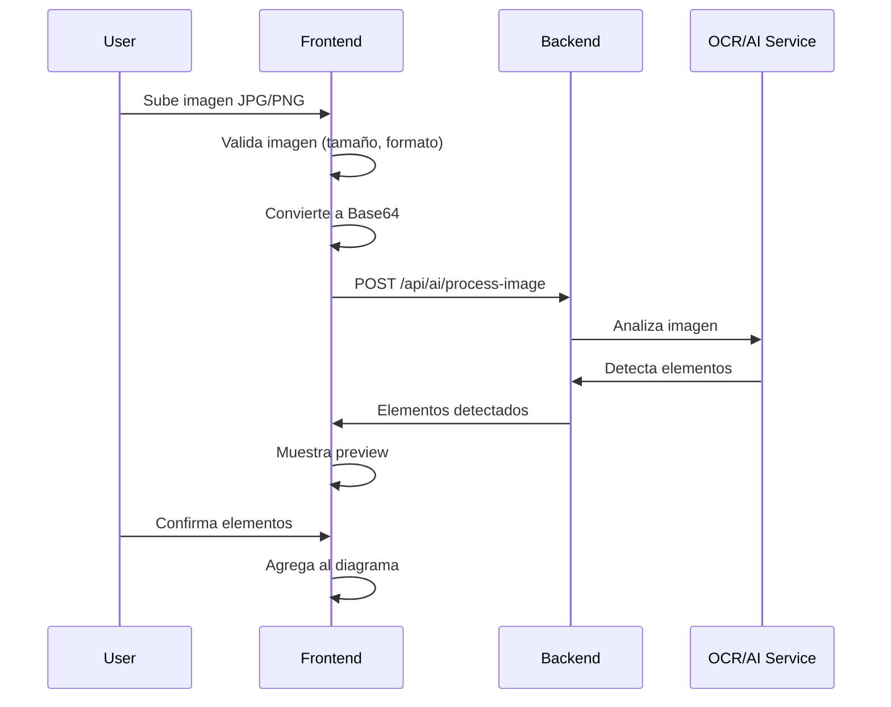

# 🤖 AI Assistant Frontend Integration Guide

## 📋 Descripción General

El **AI Assistant** es un componente de inteligencia artificial integrado en el editor UML que permite a los usuarios interactuar mediante lenguaje natural para:
- Generar diagramas UML automáticamente
- Analizar diagramas existentes
- Obtener sugerencias de mejora
- Procesar imágenes de diagramas UML
- Ejecutar comandos mediante lenguaje natural

---

## 🏗️ Arquitectura del Sistema

### Componentes Principales

```
┌─────────────────────────────────────────────────────────────┐
│                    FRONTEND (React + TypeScript)            │
├─────────────────────────────────────────────────────────────┤
│                                                             │
│  ┌──────────────────────────────────────────────────────┐  │
│  │  AIAssistantComplete.tsx (UI Component)              │  │
│  │  - Chat Interface                                    │  │
│  │  - Voice Recognition                                 │  │
│  │  - Image Upload                                      │  │
│  │  - Element Preview                                   │  │
│  └──────────────────────────────────────────────────────┘  │
│                          ↓                                  │
│  ┌──────────────────────────────────────────────────────┐  │
│  │  aiAssistantService.ts (Business Logic)              │  │
│  │  - API Communication                                 │  │
│  │  - State Management                                  │  │
│  │  - Error Handling                                    │  │
│  └──────────────────────────────────────────────────────┘  │
│                          ↓                                  │
│  ┌──────────────────────────────────────────────────────┐  │
│  │  HTTP/REST API Client                                │  │
│  └──────────────────────────────────────────────────────┘  │
│                                                             │
└─────────────────────────────────────────────────────────────┘
                          ↓ HTTP
┌─────────────────────────────────────────────────────────────┐
│                    BACKEND (Spring Boot)                    │
├─────────────────────────────────────────────────────────────┤
│                                                             │
│  📍 Endpoints requeridos (ver sección API Reference)       │
│                                                             │
└─────────────────────────────────────────────────────────────┘
```

---

## 🔐 Autenticación

### Sistema de Autenticación por Contraseña

El AI Assistant está protegido por un sistema de autenticación basado en contraseña para controlar el acceso a las funcionalidades de IA.

**Flujo de Autenticación:**

1. Usuario intenta acceder al AI Assistant
2. Se muestra modal de autenticación (`AIPasswordModal.tsx`)
3. Usuario ingresa contraseña configurada
4. Frontend valida localmente (no se envía al backend)
5. Si es correcta, se habilita acceso por sesión
6. Contraseña configurada en: `VITE_AI_PASSWORD` (environment variable)

**Configuración:**
```env
# .env
VITE_AI_PASSWORD=tu_contraseña_secreta
VITE_AI_FEATURES_ENABLED=true
```

**Hook de Autenticación:**
```typescript
// hooks/useAIAuthentication.ts
const {
  isAuthenticated,      // Estado de autenticación
  authenticateUser,     // Función para autenticar
  logout,               // Función para cerrar sesión
  attempts,             // Intentos fallidos
  maxAttempts          // Máximo de intentos permitidos
} = useAIAuthentication();
```

---

## 📡 API Reference - Endpoints Requeridos

### 1. Health Check (Estado del Servicio)

**Endpoint:** `GET /api/ai/health`

**Descripción:** Verifica el estado del servicio de IA y devuelve métricas de salud.

**Response:**
```json
{
  "status": "healthy" | "degraded" | "offline",
  "uptime": 3600,
  "model_version": "gpt-4",
  "requests_processed": 150,
  "average_response_time": 1.5,
  "timestamp": "2025-11-09T13:30:00Z"
}
```

**Códigos de Estado:**
- `200 OK` - Servicio funcionando correctamente
- `503 Service Unavailable` - Servicio no disponible

---

### 2. Pregunta General (Chat)

**Endpoint:** `POST /api/ai/ask`

**Descripción:** Permite hacer preguntas generales sobre UML y diagramas.

**Request Body:**
```json
{
  "question": "¿Cómo puedo mejorar mi diagrama de clases?",
  "context": {
    "diagram_type": "CLASS",
    "nodes_count": 5,
    "edges_count": 8,
    "has_diagram": true
  },
  "conversation_history": [
    {
      "question": "¿Qué es UML?",
      "answer": "UML es un lenguaje de modelado...",
      "timestamp": "2025-11-09T13:25:00Z"
    }
  ]
}
```

**Response:**
```json
{
  "answer": "Para mejorar tu diagrama de clases, te recomiendo...",
  "suggestions": [
    "Agregar atributos a la clase Usuario",
    "Definir relaciones entre Cliente y Pedido"
  ],
  "related_features": [
    "Análisis de diagrama",
    "Generación automática"
  ],
  "confidence": 0.95,
  "sources": [
    "UML 2.5 Specification",
    "Best Practices Guide"
  ]
}
```

**Códigos de Estado:**
- `200 OK` - Respuesta generada exitosamente
- `400 Bad Request` - Pregunta inválida o vacía
- `429 Too Many Requests` - Límite de rate limit excedido
- `500 Internal Server Error` - Error en el modelo de IA

---

### 3. Análisis de Diagrama

**Endpoint:** `POST /api/ai/analyze`

**Descripción:** Analiza un diagrama UML existente y proporciona recomendaciones.

**Request Body:**
```json
{
  "diagram": {
    "nodes": [
      {
        "id": "1",
        "type": "class",
        "data": {
          "label": "Usuario",
          "attributes": [
            {
              "name": "id",
              "type": "Integer",
              "visibility": "private"
            },
            {
              "name": "nombre",
              "type": "String",
              "visibility": "private"
            }
          ],
          "methods": [
            {
              "name": "login",
              "returnType": "boolean",
              "visibility": "public",
              "parameters": []
            }
          ]
        },
        "position": { "x": 100, "y": 100 }
      }
    ],
    "edges": [
      {
        "id": "e1",
        "source": "1",
        "target": "2",
        "type": "ASSOCIATION",
        "data": {
          "label": "tiene",
          "multiplicity_source": "1",
          "multiplicity_target": "*"
        }
      }
    ]
  },
  "analysis_type": "full" | "quick" | "security" | "performance"
}
```

**Response:**
```json
{
  "summary": "El diagrama tiene 5 clases bien estructuradas...",
  "issues": [
    {
      "severity": "warning",
      "message": "La clase Usuario no tiene método constructor",
      "suggestion": "Agregar constructor con parámetros id y nombre",
      "location": {
        "node_id": "1",
        "type": "class"
      }
    }
  ],
  "strengths": [
    "Buena separación de responsabilidades",
    "Nombres descriptivos en las clases"
  ],
  "recommendations": [
    "Considerar agregar clase abstracta base",
    "Implementar patrón Repository para persistencia"
  ],
  "metrics": {
    "complexity_score": 7.5,
    "cohesion_score": 8.0,
    "coupling_score": 6.5
  }
}
```

**Códigos de Estado:**
- `200 OK` - Análisis completado
- `400 Bad Request` - Diagrama inválido o vacío
- `422 Unprocessable Entity` - Diagrama con errores estructurales

---

### 4. Comando en Lenguaje Natural

**Endpoint:** `POST /api/ai/command`

**Descripción:** Ejecuta comandos en lenguaje natural para modificar o generar diagramas.

**Request Body:**
```json
{
  "command": "Crea un diagrama de clases para un sistema de biblioteca con libros, usuarios y préstamos",
  "current_diagram": {
    "nodes": [],
    "edges": []
  },
  "preferences": {
    "style": "clean",
    "include_methods": true,
    "include_relationships": true
  }
}
```

**Response:**
```json
{
  "action": "generate_diagram" | "modify_diagram" | "add_elements" | "delete_elements",
  "elements": [
    {
      "type": "node",
      "data": {
        "id": "generated-1",
        "type": "class",
        "data": {
          "label": "Libro",
          "nodeType": "class",
          "attributes": [
            {
              "name": "isbn",
              "type": "String",
              "visibility": "private"
            },
            {
              "name": "titulo",
              "type": "String",
              "visibility": "private"
            },
            {
              "name": "autor",
              "type": "String",
              "visibility": "private"
            }
          ],
          "methods": [
            {
              "name": "prestar",
              "returnType": "boolean",
              "visibility": "public",
              "parameters": []
            }
          ]
        },
        "position": { "x": 100, "y": 100 }
      }
    },
    {
      "type": "edge",
      "data": {
        "id": "generated-edge-1",
        "source": "generated-1",
        "target": "generated-2",
        "type": "ASSOCIATION",
        "data": {
          "relationship": "ASSOCIATION",
          "label": "tiene",
          "multiplicity_source": "1",
          "multiplicity_target": "*"
        }
      }
    }
  ],
  "confidence": 0.92,
  "interpretation": "He generado 3 clases: Libro, Usuario y Préstamo con sus relaciones correspondientes",
  "success": true,
  "message": "Diagrama generado exitosamente"
}
```

**Códigos de Estado:**
- `200 OK` - Comando ejecutado exitosamente
- `400 Bad Request` - Comando no entendible
- `422 Unprocessable Entity` - No se puede ejecutar el comando

---

### 5. Procesamiento de Imagen

**Endpoint:** `POST /api/ai/process-image`

**Descripción:** Analiza una imagen de diagrama UML y genera el diagrama digital.

**Request Body:**
```json
{
  "image": "data:image/png;base64,iVBORw0KGgoAAAANSUhEUgAA...",
  "diagram_type": "CLASS" | "SEQUENCE" | "USE_CASE",
  "options": {
    "auto_layout": true,
    "preserve_positions": false,
    "generate_code": false
  }
}
```

**Response:**
```json
{
  "success": true,
  "elements": [
    {
      "type": "node",
      "data": {
        "id": "detected-1",
        "type": "class",
        "data": {
          "label": "Usuario",
          "attributes": [
            {
              "name": "id",
              "type": "Integer",
              "visibility": "private"
            }
          ],
          "methods": []
        },
        "position": { "x": 150, "y": 200 }
      }
    }
  ],
  "detected_elements_count": 5,
  "confidence": 0.88,
  "processing_time": 2.3,
  "warnings": [
    "No se pudo detectar la multiplicidad en la relación entre Usuario y Pedido"
  ]
}
```

**Códigos de Estado:**
- `200 OK` - Imagen procesada exitosamente
- `400 Bad Request` - Imagen inválida o demasiado grande
- `415 Unsupported Media Type` - Formato de imagen no soportado
- `422 Unprocessable Entity` - No se detectaron elementos UML

---

### 6. Estadísticas del Servicio

**Endpoint:** `GET /api/ai/statistics`

**Descripción:** Obtiene estadísticas de uso del servicio de IA.

**Response:**
```json
{
  "total_questions": 1250,
  "diagrams_analyzed": 340,
  "commands_executed": 890,
  "images_processed": 120,
  "average_response_time": 1.8,
  "success_rate": 0.94,
  "most_common_questions": [
    "¿Cómo crear una relación de herencia?",
    "¿Qué diferencia hay entre agregación y composición?"
  ],
  "popular_commands": [
    "Generar diagrama de clases",
    "Agregar métodos a la clase"
  ]
}
```

---

## 🎨 Tipos de TypeScript (Contratos de Datos)

### Request Types

```typescript
// Pregunta general
export interface AIAssistantRequest {
  question: string;
  context?: AIAssistantContext;
  conversation_history?: AIConversationEntry[];
}

// Contexto del diagrama
export interface AIAssistantContext {
  diagram_type?: 'CLASS' | 'SEQUENCE' | 'USE_CASE' | 'ACTIVITY';
  nodes_count?: number;
  edges_count?: number;
  has_diagram?: boolean;
  current_diagram?: {
    nodes: any[];
    edges: any[];
  };
  selected_elements?: string[];
  user_preferences?: {
    language?: string;
    detail_level?: 'basic' | 'detailed' | 'expert';
  };
}

// Análisis de diagrama
export interface DiagramAnalysisRequest {
  diagram: {
    nodes: any[];
    edges: any[];
  };
  analysis_type: 'full' | 'quick' | 'security' | 'performance';
}

// Comando en lenguaje natural
export interface NaturalLanguageCommandRequest {
  command: string;
  current_diagram: {
    nodes: any[];
    edges: any[];
  };
  preferences?: {
    style?: 'clean' | 'detailed';
    include_methods?: boolean;
    include_relationships?: boolean;
  };
}

// Procesamiento de imagen
export interface ImageProcessingRequest {
  image: string; // Base64 encoded
  diagram_type?: 'CLASS' | 'SEQUENCE' | 'USE_CASE';
  options?: {
    auto_layout?: boolean;
    preserve_positions?: boolean;
    generate_code?: boolean;
  };
}
```

### Response Types

```typescript
// Respuesta general del asistente
export interface AIAssistantResponse {
  answer: string;
  suggestions?: string[];
  related_features?: string[];
  confidence?: number;
  sources?: string[];
}

// Análisis de diagrama
export interface DiagramAnalysis {
  summary: string;
  issues: Array<{
    severity: 'error' | 'warning' | 'info';
    message: string;
    suggestion?: string;
    location?: {
      node_id?: string;
      edge_id?: string;
      type: string;
    };
  }>;
  strengths: string[];
  recommendations: string[];
  metrics?: {
    complexity_score: number;
    cohesion_score: number;
    coupling_score: number;
  };
}

// Respuesta de comando
export interface NaturalLanguageCommandResponse {
  action: 'generate_diagram' | 'modify_diagram' | 'add_elements' | 'delete_elements';
  elements: Array<{
    type: 'node' | 'edge';
    data: any;
  }>;
  confidence: number;
  interpretation: string;
  success: boolean;
  message?: string;
}

// Estado de salud del servicio
export interface AIHealthStatus {
  status: 'healthy' | 'degraded' | 'offline';
  uptime: number;
  model_version?: string;
  requests_processed?: number;
  average_response_time?: number;
  timestamp: string;
}

// Estadísticas
export interface AIStatistics {
  total_questions: number;
  diagrams_analyzed: number;
  commands_executed: number;
  images_processed?: number;
  average_response_time: number;
  success_rate: number;
  most_common_questions?: string[];
  popular_commands?: string[];
}
```

---

## 🔄 Flujos de Trabajo

### Flujo 1: Pregunta Simple



### Flujo 2: Generación de Diagrama por Comando



### Flujo 3: Procesamiento de Imagen



---

## ⚙️ Configuración del Frontend

### Variables de Entorno

```env
# .env
# AI Service Configuration
VITE_AI_API_URL=http://localhost:8080/api/ai
VITE_AI_TIMEOUT=60000
VITE_AI_FEATURES_ENABLED=true
VITE_AI_PASSWORD=your_secure_password

# Rate Limiting
VITE_AI_MAX_REQUESTS_PER_MINUTE=20
VITE_AI_CONVERSATION_HISTORY_LIMIT=10

# Image Processing
VITE_AI_MAX_IMAGE_SIZE=5242880  # 5MB
VITE_AI_ALLOWED_IMAGE_TYPES=image/png,image/jpeg,image/jpg
```

### Servicio de AI Assistant

```typescript
// services/aiAssistantService.ts
class AIAssistantService {
  private baseUrl: string;
  private timeout: number;

  constructor() {
    this.baseUrl = import.meta.env.VITE_AI_API_URL || 'http://localhost:8080/api/ai';
    this.timeout = parseInt(import.meta.env.VITE_AI_TIMEOUT || '60000');
  }

  // Configuración de fetch con timeout
  private async fetchWithTimeout(url: string, options: RequestInit = {}): Promise<Response> {
    const controller = new AbortController();
    const timeoutId = setTimeout(() => controller.abort(), this.timeout);

    try {
      const response = await fetch(url, {
        ...options,
        signal: controller.signal,
        headers: {
          'Content-Type': 'application/json',
          ...options.headers,
        },
      });
      clearTimeout(timeoutId);
      return response;
    } catch (error) {
      clearTimeout(timeoutId);
      throw error;
    }
  }

  // Health check
  async checkHealth(): Promise<AIHealthStatus> {
    const response = await this.fetchWithTimeout(`${this.baseUrl}/health`);
    if (!response.ok) {
      throw new Error(`Health check failed: ${response.status}`);
    }
    return response.json();
  }

  // Pregunta general
  async askQuestion(request: AIAssistantRequest): Promise<AIAssistantResponse> {
    const response = await this.fetchWithTimeout(`${this.baseUrl}/ask`, {
      method: 'POST',
      body: JSON.stringify(request),
    });

    if (!response.ok) {
      const error = await response.json();
      throw new Error(error.message || 'Error processing question');
    }

    return response.json();
  }

  // Análisis de diagrama
  async analyzeDiagram(request: DiagramAnalysisRequest): Promise<DiagramAnalysis> {
    const response = await this.fetchWithTimeout(`${this.baseUrl}/analyze`, {
      method: 'POST',
      body: JSON.stringify(request),
    });

    if (!response.ok) {
      throw new Error('Error analyzing diagram');
    }

    return response.json();
  }

  // Comando en lenguaje natural
  async executeCommand(request: NaturalLanguageCommandRequest): Promise<NaturalLanguageCommandResponse> {
    const response = await this.fetchWithTimeout(`${this.baseUrl}/command`, {
      method: 'POST',
      body: JSON.stringify(request),
    });

    if (!response.ok) {
      throw new Error('Error executing command');
    }

    return response.json();
  }

  // Procesamiento de imagen
  async processImage(request: ImageProcessingRequest): Promise<NaturalLanguageCommandResponse> {
    const response = await this.fetchWithTimeout(`${this.baseUrl}/process-image`, {
      method: 'POST',
      body: JSON.stringify(request),
    });

    if (!response.ok) {
      throw new Error('Error processing image');
    }

    return response.json();
  }

  // Estadísticas
  async getStatistics(): Promise<AIStatistics> {
    const response = await this.fetchWithTimeout(`${this.baseUrl}/statistics`);
    
    if (!response.ok) {
      throw new Error('Error fetching statistics');
    }

    return response.json();
  }
}

export const aiAssistantService = new AIAssistantService();
```

---

## 🎯 Ejemplos de Uso

### Ejemplo 1: Pregunta Simple

**Request:**
```bash
curl -X POST http://localhost:8080/api/ai/ask \
  -H "Content-Type: application/json" \
  -d '{
    "question": "¿Qué es una clase abstracta en UML?",
    "context": {
      "diagram_type": "CLASS",
      "has_diagram": false
    }
  }'
```

**Response:**
```json
{
  "answer": "Una clase abstracta en UML es una clase que no puede ser instanciada directamente y está diseñada para ser heredada por otras clases. Se representa con el nombre en cursiva o con el estereotipo <<abstract>>.",
  "suggestions": [
    "Crear una clase abstracta en tu diagrama",
    "Ver ejemplos de herencia"
  ],
  "confidence": 0.98
}
```

### Ejemplo 2: Generar Diagrama

**Request:**
```bash
curl -X POST http://localhost:8080/api/ai/command \
  -H "Content-Type: application/json" \
  -d '{
    "command": "Crea 3 clases: Usuario, Producto y Pedido con relaciones",
    "current_diagram": {
      "nodes": [],
      "edges": []
    },
    "preferences": {
      "include_methods": true
    }
  }'
```

**Response:**
```json
{
  "action": "generate_diagram",
  "elements": [
    {
      "type": "node",
      "data": {
        "id": "gen-1",
        "type": "class",
        "data": {
          "label": "Usuario",
          "attributes": [
            { "name": "id", "type": "Integer", "visibility": "private" },
            { "name": "nombre", "type": "String", "visibility": "private" }
          ],
          "methods": [
            { "name": "realizarPedido", "returnType": "Pedido", "visibility": "public" }
          ]
        },
        "position": { "x": 100, "y": 100 }
      }
    }
  ],
  "confidence": 0.95,
  "interpretation": "He creado 3 clases con sus atributos básicos y métodos relevantes",
  "success": true
}
```

---

## 🚨 Manejo de Errores

### Códigos de Error Comunes

| Código | Significado | Acción del Frontend |
|--------|-------------|---------------------|
| `400` | Bad Request | Mostrar error de validación al usuario |
| `401` | Unauthorized | Redirigir a login |
| `403` | Forbidden | Mostrar mensaje de acceso denegado |
| `404` | Not Found | Endpoint no existe |
| `422` | Unprocessable Entity | Datos inválidos, mostrar detalles |
| `429` | Too Many Requests | Mostrar mensaje de rate limit |
| `500` | Internal Server Error | Mostrar error genérico |
| `503` | Service Unavailable | Modo offline, mostrar ayuda local |

### Ejemplo de Respuesta de Error

```json
{
  "error": {
    "code": "INVALID_DIAGRAM",
    "message": "El diagrama contiene nodos sin tipo definido",
    "details": {
      "invalid_nodes": ["node-123", "node-456"],
      "suggestion": "Asegúrate de que todos los nodos tengan un tipo válido"
    },
    "timestamp": "2025-11-09T13:30:00Z"
  }
}
```

### Manejo en Frontend

```typescript
try {
  const response = await aiAssistantService.askQuestion(request);
  // Procesar respuesta exitosa
} catch (error: any) {
  if (error.status === 429) {
    toast.error('Demasiadas solicitudes. Por favor espera un momento.');
  } else if (error.status === 503) {
    // Activar modo offline
    showOfflineHelp();
  } else {
    toast.error(error.message || 'Error al procesar la solicitud');
  }
}
```

---

## 📊 Rate Limiting y Throttling

### Límites Esperados

- **Preguntas generales:** 20 solicitudes por minuto por usuario
- **Análisis de diagrama:** 10 solicitudes por minuto por usuario
- **Comandos:** 15 solicitudes por minuto por usuario
- **Procesamiento de imágenes:** 5 solicitudes por minuto por usuario

### Headers de Rate Limit

```
X-RateLimit-Limit: 20
X-RateLimit-Remaining: 15
X-RateLimit-Reset: 1699545600
```

---

## 🔍 Testing

### Endpoints de Test

Para facilitar el desarrollo, se pueden crear endpoints de test:

```bash
# Health check
GET /api/ai/health

# Ping simple
GET /api/ai/ping
Response: { "message": "pong", "timestamp": "..." }

# Echo test
POST /api/ai/echo
Body: { "message": "test" }
Response: { "echo": "test", "received_at": "..." }
```

---

## 📝 Notas Importantes

1. **Timeouts:** El frontend espera respuestas en máximo 60 segundos
2. **Tamaño de Imágenes:** Máximo 5MB por imagen
3. **Formatos Soportados:** PNG, JPEG, JPG
4. **Codificación:** Todas las imágenes se envían en Base64
5. **CORS:** El backend debe permitir requests desde el origen del frontend
6. **Historial:** Se mantienen las últimas 10 conversaciones en memoria
7. **Autenticación:** Por ahora es local (frontend), pero puede extenderse a JWT

---

## 🎨 Componentes UI Relacionados

### Componentes Principales

1. **AIAssistantComplete.tsx** - Componente principal del chat
2. **ResponseDisplay.tsx** - Renderiza respuestas con markdown
3. **ElementPreviewCard.tsx** - Muestra preview de elementos generados
4. **ImageUploadModal.tsx** - Modal para subir imágenes
5. **LoadingIndicator.tsx** - Animaciones de carga
6. **HealthStatus.tsx** - Estado del servicio

---

## 🔗 Enlaces de Referencia

- **Repositorio Frontend:** [ficct-springcode-frontend](https://github.com/Victoroide/ficct-springcode-frontend)
- **Documentación de Tipos:** `/src/types/aiAssistant.ts`
- **Servicio de IA:** `/src/services/aiAssistantService.ts`
- **Componente Principal:** `/src/components/ai-assistant/AIAssistantComplete.tsx`

---

## 📞 Contacto y Soporte

Para preguntas sobre la integración del AI Assistant:
- **Email:** soporte@springcode.example.com
- **Slack:** #ai-assistant-dev
- **Documentación:** [Wiki del Proyecto](https://wiki.springcode.example.com/ai-assistant)

---

**Versión del Documento:** 1.0.0  
**Última Actualización:** 9 de Noviembre, 2025  
**Autor:** Equipo de Desarrollo SpringCode Frontend
